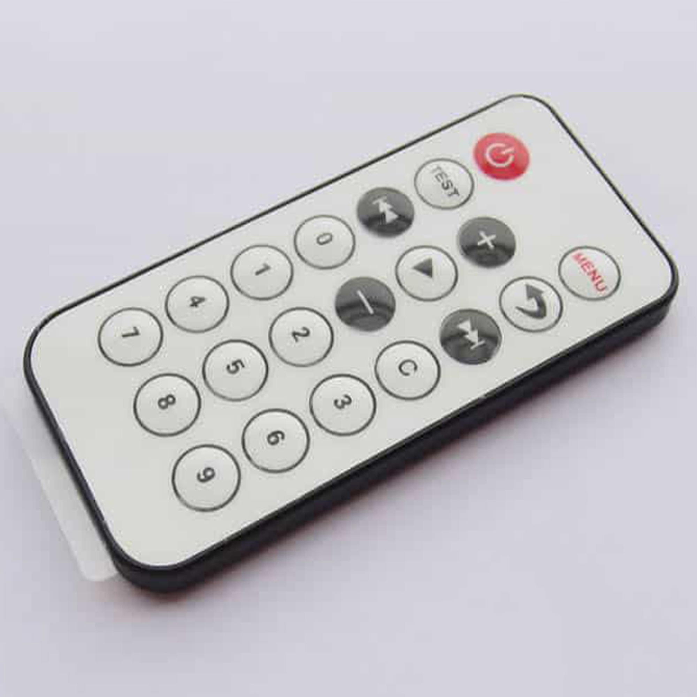
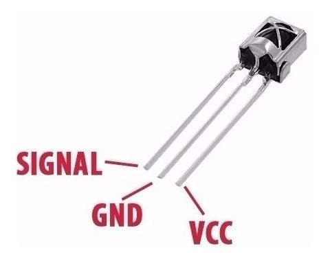
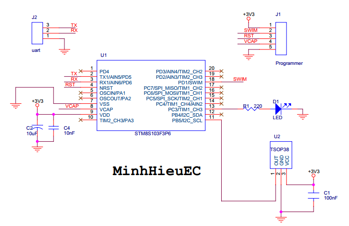
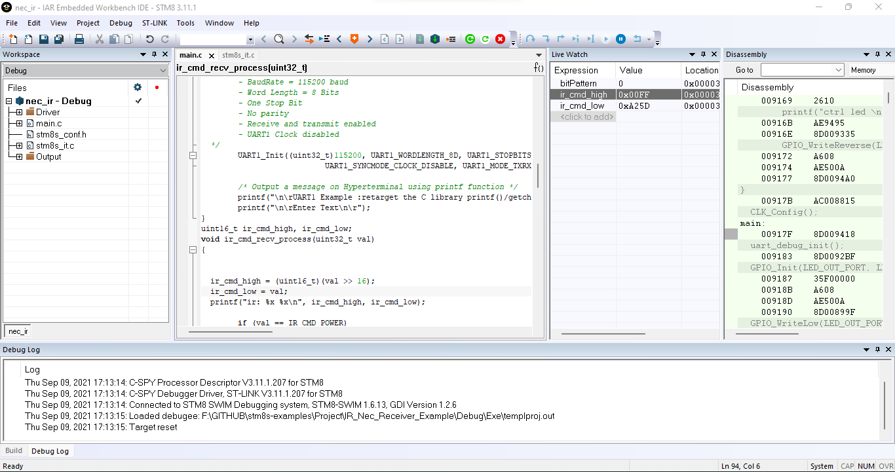
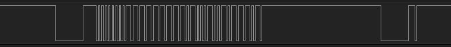

# STM8S IR Receiver

## Hardware

- MCU: `STM8S103F3P6`

- IR Remote

- IR Receiver: `TSOP1838`

- Schematic:

## Output

push key POWER on remote, the picture following is result:

- Live Watch on IAR IDE: `0xFFA25D`

- Analyzer: : `0xFFA25D`

