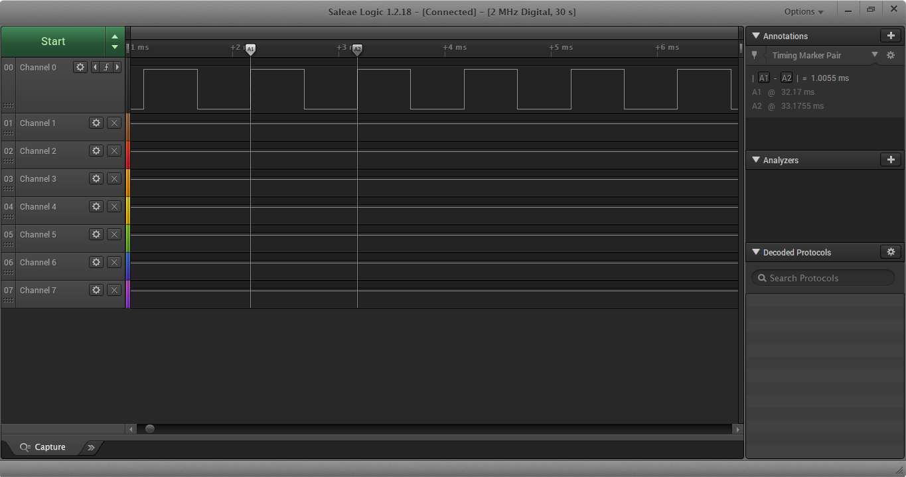

# Generate PWM With Timer 1 Chanel 4

## Hardware
- mcu: `STM8S103F3P6`

## Configuration

### System clock

This example using 16MHz clock from HSI.

```c
void SystemClock_Init(void)
{
   CLK_DeInit();
   CLK_HSICmd(ENABLE);
   CLK_HSIPrescalerConfig(CLK_PRESCALER_HSIDIV1);
   CLK_SYSCLKConfig(CLK_PRESCALER_CPUDIV1);
}
```

### Timer Tick

```c
uint16_t prescaler = 15;
TIM1_TimeBaseInit(prescaler, TIM1_COUNTERMODE_UP, period, 0);
```

setup timer tick is `1ms`: `1/(16000000/(prescaler + 1))`


### PWM config

```c
uint16_t period = 999;
TIM1_OC4Init(TIM1_OCMODE_PWM1, TIM1_OUTPUTSTATE_ENABLE, ((period+1)/2), TIM1_OCPOLARITY_HIGH, TIM1_OCIDLESTATE_RESET);
TIM1_OC4PreloadConfig(ENABLE);
```

This example using timer1 as pwm mode. 
`((period+1)/2)` for 50% duty cycle.




## References

- http://burakketen.com/2018/modbus_and_porting_freemodbus/

- https://blog.csdn.net/zgkxzx/article/details/46560979

- https://programmer.group/stm8-learning-notes-simple-porting-of-modbus-communication-protocol.html

- https://github.com/Jian-Zhan/STM8S-freemodbus