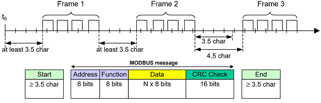
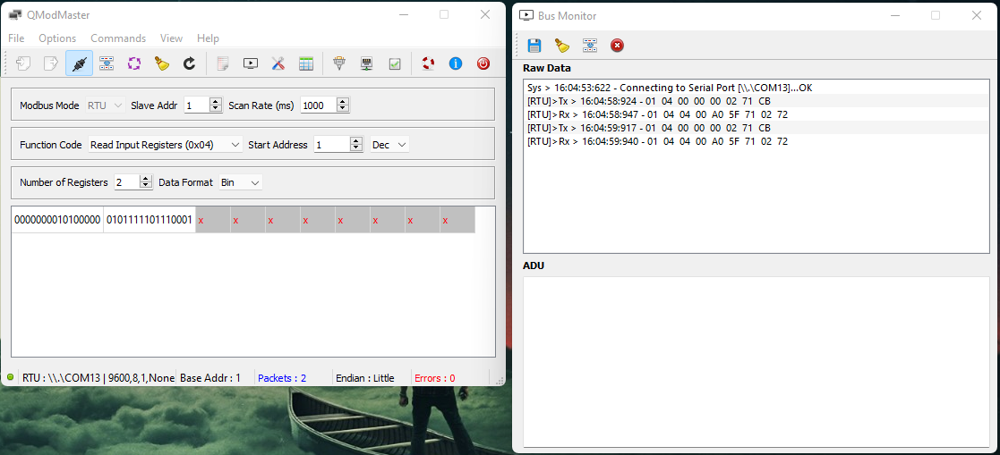
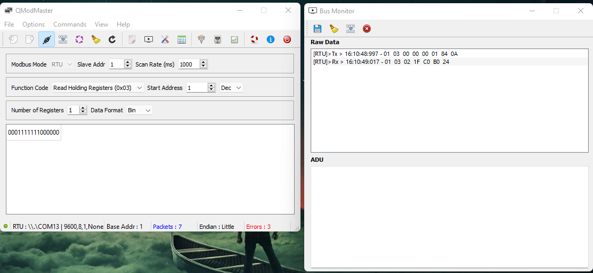

# Slave Modbus RTU Example

I'm using freemodbus v1.6 for this example (https://www.embedded-experts.at/en/freemodbus-downloads/).



## Hardware
- mcu: `STM8S103F3P6`

## Tool test

- https://sourceforge.net/projects/qmodmaster/
- https://www.modbustools.com/download.html

## Circuit

| STM8S           | Uart TTL        |
| -------------   | -------------   |
| PD5 (TX)        | RX              |
| PD6 (RX)        | TX              |
| GND             | GND             |

## Test

### Function code "Read Input Register (0x04)"



#### Set Start address:
```c
#define REG_INPUT_START 0x0000
```

#### Set register length (Quantity):
```c
#define REG_INPUT_NREGS 2
```

### Function code "Read Holding Register (0x03)"



#### Set Start address:
```c
#define REG_HOLDING_START 0x0000
```

#### Set holding length (Quantity):
```c
#define REG_HOLDING_NREGS 1
```


## References

- http://burakketen.com/2018/modbus_and_porting_freemodbus/

- https://blog.csdn.net/zgkxzx/article/details/46560979

- https://programmer.group/stm8-learning-notes-simple-porting-of-modbus-communication-protocol.html

- https://github.com/Jian-Zhan/STM8S-freemodbus